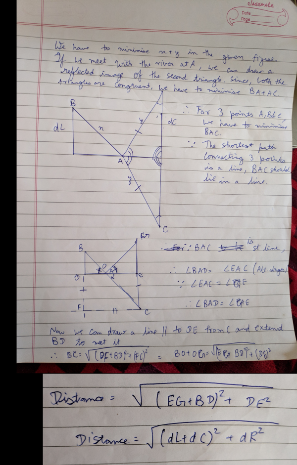

# [CQM-6.3](https://www.hackerrank.com/contests/cqm-6-3/)

# Editorials

## [Dashiell And High Jump](https://www.hackerrank.com/contests/cqm-6-3/challenges/dashiell-and-high-jump)

This is a cakewalk problem on array. Initialise a variable "high_jump" to the height of first wall because there is at least one wall to jump. Now traverse the array if the next element is greater than previous, find difference and compare with "high_jump". If difference is greater than "high_jump", update it with value of difference. Final value of "high_jump" is the highest jump made by him.


Code (in C++) :
```cpp
#include<bits/stdc++.h>
using namespace std;

int main(){
  int t; cin>>t;
  while(t--){
    int n; cin>>n;
    int h[n];
    for(int i=0; i<n; i++)cin>>h[i];
    int high_jump=h[0];
    for(int i=0; i<n-1; i++){
        high_jump = max(high_jump, (h[i+1]-h[i]));
    }
    cout<<high_jump<<endl;
  }
  return 0;
}

```
## [Substring Game] 
The game ends in two conditions. First, if string becomes empty and second if the string becomes only of zeros or ones. So, the total number of moves are minimum of x and y, where x is the count of ones in the string and y is the count of zeros in the string. If the total number of moves is even then 'Bob' wins the game else 'Alice' win the game.

Code(in C++) :
``` cpp
#include <bits/stdc++.h>
using namespace std;

int main()
{
    int t;
    cin >> t;

    while(t--)
    {
        int n;
        cin >> n;

        string s;
        cin >> s;

        int c1,c2;
        c1 = c2 = 0;

        for(auto i:s)
            i == '1' ? c1++ : c2++;

        if(min(c1,c2)%2)
            cout << "Alice\n";
        else
            cout << "Bob\n";
    }
    
    return 0;
}
```
## [Brady and the river](https://www.hackerrank.com/contests/cqm-6-3/challenges/brady-and-the-river)

You can use ternary search or use geometry to find the answer.




## [Mark And His Girlfriend](https://www.hackerrank.com/contests/cqm-6-3/challenges/mark-and-his-girlfriend)

This is a classicl dynamic programming problem that we can solve recursively.
Let's define a function named "solve(i,make)" that finds the number of ways to make "make" using coins from i to "numCoins". From this state, you have two options:

1. Take coin "i", making the next state "solve(i,make-c[i])".
2. Go on to the next coin, making the next state "solve(i+1,make)".

The answer for "solve(i,make)" will be the sum of those two subproblems. If "make" becomes "0", then return "1" (because there is only  way to make change for "0" units — don't take any coins!).

Don't forget to eliminate the overlapping subproblems using memoization, or your solution will time out. It's also important to note that the answer may be larger than a 32-bit integer.


Code (in C++) :
```cpp
#include <bits/stdc++.h>
#define ll long long
using namespace std;

int c[52];
int numCoins;
ll table[52][252];
bool calculated[52][252];
ll solve(int i, int make){
    if(make<0) return 0;
    if(make==0)return 1;
    if(i>numCoins) return 0;
    if(calculated[i][make]==false){
        table[i][make] = solve(i,make-c[i]) + solve(i+1,make);
        calculated[i][make] = true;
    }
    return table[i][make];
}
int main(){
    int make;
    cin>>make>>numCoins;
    for(int i=1;i<=numCoins;i++){cin>>c[i];}
    cout<<solve(1,make)<<endl;
    return 0;
}

```
